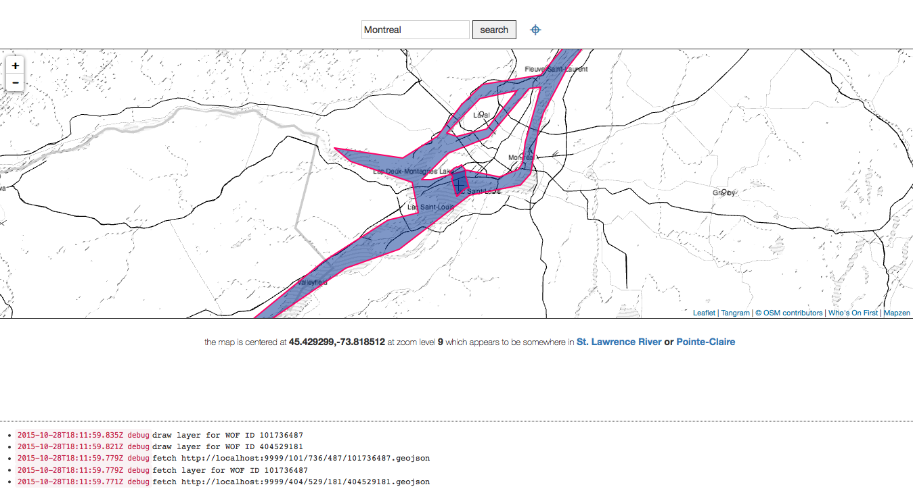

# whosonfirst-www-iamhere



`whosonfirst-www-iamhere` is a small web application for displaying coordinates based on the position of the map. Plus Who's on First data, optionally.

## Usage

### Running locally - simple

There is one thing you need to run `whosonfirst-www-iamhere` locally in "simple" mode. Simple mode just means a map with live-updating information about its position.

* An HTTP file server for the `whosonfirst-www-iamhere` itself. This is because some browsers are super conservative about what can and can't run on `localhost` (aka your local machine) and what can be served from a `file://` URL (aka your hard drive) the [tangram.js](https://github.com/tangrams/tangram) maps need to be "served" from an actual web server.

### Running locally - fancy

There are four separate components to running `whosonfirst-www-iamhere` locally in "fancy" mode. Fancy mode means a map with live-updating information about its position that will reverse-geocode those coordinates and display their corresponding Who's On First polygons. Optionally, you can also enable searching for a specific place using the [Mapzen Search API](https://mapzen.com/projects/search).

They are:

* An HTTP file server for the `whosonfirst-www-iamhere` itself. This is because some browsers are super conservative about what can and can't run on `localhost` (aka your local machine) and what can be served from a `file://` URL (aka your hard drive) the [tangram.js](https://github.com/tangrams/tangram) maps need to be "served" from an actual web server.

* An HTTP file server (that can set `CORS` headers) for the serving Who's On First data.

* The [go-whosonfirst-pip](https://github.com/whosonfirst/go-whosonfirst-pip) point-in-polygon server used to query the data. 

* A copy of the [whosonfirst-data](https://github.com/whosonfirst/whosonfirst-data) repository. You don't actually need all of the data. You just need all of the files listed in the CSV file(s) that the point-in-polygon server needs to load in folder organized in the standard Who's On First `123/456/7/1234567.geojson` tree structure.

* Surprise! There is also a fifth moving part, which is a local (Javascript) settings file that you will need to configure by hand. Conveniently there is a sample versions which can simply rename if you want to use all the default settings.

#### pip-server

This is a small application written in the `Go` programming language that exposes point-in-polygon functionality over an HTTP API and is part of the [go-whosonfirst-pip](https://github.com/whosonfirst/go-whosonfirst-pip/) repository. _You will need to download, install and configure it yourself but [it's not very hard](https://github.com/whosonfirst/go-whosonfirst-howto)._

```
$> pip-server -port 8080 -cors -data /usr/local/mapzen/whosonfirst-data/data /usr/local/mapzen/whosonfirst-data/meta/wof-neighbourhood-latest.csv /usr/local/mapzen/whosonfirst-data/meta/wof-marinearea-latest.csv 
```

By default everything in this repository assumes the point-in-polygon server is running on port `8080`. If you change that you will need to update the `mapzen.whosonfirst.pip.endpoint` setting in config file, described below.

#### data server

This can be anything you want it to be, really, just as long as the data is returned with the `CORS` headers enabled.

We have written a small HTTP-based static webserver in the `Go` programming language called `wof-fileserver` that is part of the [go-whosonfirst-fileserver](https://github.com/whosonfirst/go-whosonfirst-fileserver) repository.  _You will need to download, install and configure it yourself but [it's not very hard](https://github.com/whosonfirst/go-whosonfirst-howto)._

```
$> wof-fileserver -port 9999 -path /usr/local/mapzen/whosonfirst-data/data/ -cors
```

By default everything in this repository assumes the point-in-polygon server is running on port `9999`. If you change that you will need to update the `mapzen.whosonfirst.data.endpoint` setting in config file, described below.

#### file server

This can be anything you want it to be. (It doesn't even have to set `CORS` headers.) We have written a small HTTP-based static webserver in the `Go` programming language called `wof-fileserver` that is part of the [go-whosonfirst-fileserver](https://github.com/whosonfirst/go-whosonfirst-fileserver) repository.  _You will need to download, install and configure it yourself but [it's not very hard](https://github.com/whosonfirst/go-whosonfirst-howto)._

```
$> wof-fileserver -port 8001 -path /usr/local/mapzen/whosonfirst-www-iamhere/www/
```

#### mapzen.whosonfirst.config.js

In the `www/javascript` folder there is a file called `mapzen.whosonfirst.config.js.sample`. Make a copy of it called `mapzen.whosonfirst.config.js`. That's it. Unless you need or want to tailor anything to your needs. Available knobs include:

* Specifying a different endpoint for the point-in-polygon server
* Specifying a different endpoint for the Who's on First data server
* Specifying a [Pelias API key](https://mapzen.com/projects/search) if you want to enabled geocoding
* Specifying a different endpoint for the Pelias (Mapzen Search) API (for example if you're running your own instance)
* Toggling whether or not to display verbose logging in the web application

The `mapzen.whosonfirst.config.js` file is explicitly excluded from being checked-in to the `whosonfirst-www-iamhere` repository.

### Running remotely

_This section is still being written_

## Caveats

This mostly works but is still a work-in-progress.

## See also

* https://github.com/whosonfirst/whosonfirst-data
* https://github.com/whosonfirst/go-whosonfirst-pip
* https://github.com/whosonfirst/go-whosonfirst-fileserver
* https://github.com/whosonfirst/go-whosonfirst-howto
